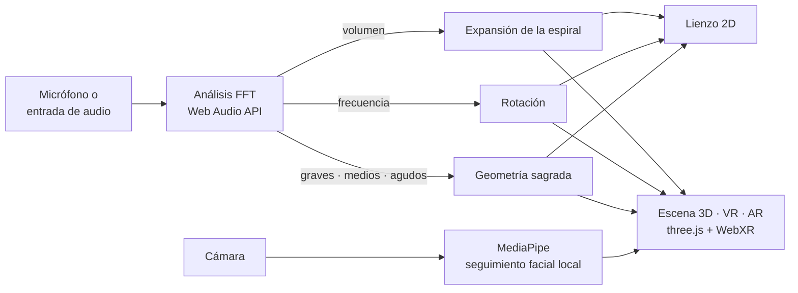

<div align="center">


# Audiomorphic

**Convierte el sonido en geometría sagrada viva: en tu pantalla, en realidad virtual y sobre tu propio espacio en realidad aumentada.**

[](https://github.com/StarSeedSystem/Audiomorphic-AR-app/releases/latest)
[](#licencia)
[](https://audiomorphic.vercel.app)
[](#descargas)

[**Abrir en la web**](https://audiomorphic.vercel.app) · [**Descargas**](#descargas) · [**Documentación**](#cómo-funciona)

</div>

> **In short (English):** Audiomorphic is a real-time audio visualizer that turns sound into living sacred geometry. Volume expands the spiral, frequency rotates it, and bass, mids and treble shape 20 geometry modes. It runs in the browser, as desktop and Android apps, in VR (WebXR) and in AR with your camera. Free to use, with or without an account. Part of the StarSeed ecosystem: it also runs inside [StarSeed OS](https://starseed-os.vercel.app). [Latest release](https://github.com/StarSeedSystem/Audiomorphic-AR-app/releases/latest).

---

## Qué es

Audiomorphic escucha lo que suena a tu alrededor (música, voz, un cuenco tibetano) y lo transforma al instante en una espiral y en figuras de geometría sagrada que respiran con el sonido. Sirve para meditar, acompañar un concierto, proyectar visuales o simplemente mirar la música.

Todas las funciones son **gratuitas**, con o sin cuenta. La cuenta de StarSeed es opcional y solo sirve para guardar tus presets en la nube.

## Descargas

Versión actual: **v1.2.0** (15 de septiembre de 2026). Usa siempre **[la última versión](https://github.com/StarSeedSystem/Audiomorphic-AR-app/releases/latest)** para no quedarte con un enlace viejo.

| Sistema | Archivo | Tamaño | Cómo instalar |
|---|---|---|---|
| Android 6.0 o superior | [`Audiomorphic_v1.2.0.apk`](https://github.com/StarSeedSystem/Audiomorphic-AR-app/releases/download/v1.2.0/Audiomorphic_v1.2.0.apk) | 5,5 MB | Abre el APK y permite «instalar apps desconocidas» si te lo pide. |
| macOS (Apple Silicon) | [`Audiomorphic_v1.2.0_macOS_arm64.dmg`](https://github.com/StarSeedSystem/Audiomorphic-AR-app/releases/download/v1.2.0/Audiomorphic_v1.2.0_macOS_arm64.dmg) | 213 MB | Abre el `.dmg` y arrastra Audiomorphic a Aplicaciones. |
| Windows 10/11 | [`Audiomorphic_v1.2.0_Windows.zip`](https://github.com/StarSeedSystem/Audiomorphic-AR-app/releases/download/v1.2.0/Audiomorphic_v1.2.0_Windows.zip) | 134 MB | Descomprime y abre la app, sin instalar. |
| Linux x64 | [`Audiomorphic_v1.2.0_Linux_x64.tar.gz`](https://github.com/StarSeedSystem/Audiomorphic-AR-app/releases/download/v1.2.0/Audiomorphic_v1.2.0_Linux_x64.tar.gz) | 774 MB | `tar -xzf Audiomorphic_v1.2.0_Linux_x64.tar.gz` y abre el ejecutable de la carpeta. |
| Linux ARM64 | [`Audiomorphic_v1.2.0_Linux_arm64.tar.gz`](https://github.com/StarSeedSystem/Audiomorphic-AR-app/releases/download/v1.2.0/Audiomorphic_v1.2.0_Linux_arm64.tar.gz) | 694 MB | Igual que x64 (Raspberry Pi, Asahi…). |
| Web / PWA | [audiomorphic.vercel.app](https://audiomorphic.vercel.app) | — | Sin instalar nada; también se instala como app. ¿Mac con Intel o iPhone? Usa esta opción. |

**Primera apertura.** Los binarios no están firmados por Apple ni Microsoft: en macOS haz clic derecho → **Abrir**; en Windows, **Más información → Ejecutar de todas formas**. Hay además un [espejo en Google Drive](https://drive.google.com/drive/folders/1bZ8yvbWr7r3eJUdKIQCSSuu-p398mAkn?usp=sharing) por si GitHub va lento.

**Actualizaciones.** La web siempre sirve la última versión. En las apps instaladas, la pestaña **Actualizaciones** del Centro de Información enlaza el instalador adecuado para tu sistema.

## Funciones principales

- **Análisis del sonido en vivo**: separa graves, medios y agudos (FFT) y mide volumen y frecuencia dominante, con sensibilidad y rango ajustables.
- **20 geometrías**: espiral áurea, flor de la vida, cubo de Metatrón, merkaba, sólidos platónicos, Sri Yantra, cimática, toroide, árbol de la vida, mandalas, flor de loto y más.
- **Piloto automático** con tres modos (Génesis, Armónico y Deriva) para sesiones largas sin tocar nada.
- **29 presets incluidos** por categorías, más los tuyos, con carpetas, exportación e importación en JSON.
- **Realidad virtual (WebXR)** para visores como Meta Quest, y giroscopio en el móvil cuando no hay visor.
- **Realidad aumentada**: la geometría sobre tu entorno con la cámara, con filtros (psicodélico, neón, glitch, sueño…), y **modo Portal**, que sigue tu cara para dar profundidad real a la escena.
- **Elige micrófono y salida de audio** (altavoces, auriculares Bluetooth, interfaces).
- **Pantalla siempre encendida** durante las sesiones y panel de diagnóstico de micrófono, cámara, audio, VR y wake lock.
- **Dentro de StarSeed OS**: se abre en `/audiomorphic` y puede ser el fondo animado del escritorio.

## Cómo funciona



- **Espiral ↔ volumen.** La espiral se dibuja como una recurrencia compleja: cuanto más fuerte suena, más se expande y más gruesa es su línea. En silencio conserva un pulso mínimo para no apagarse.
- **Rotación ↔ frecuencia.** La frecuencia dominante aumenta el ángulo que gira cada paso de la recurrencia: los agudos retuercen la espiral más que los graves. Con el color armónico activado, la frecuencia también cambia el tono.
- **Bandas ↔ movimiento.** Con el piloto automático, los graves engrosan y expanden la espiral, los medios la hacen girar y los agudos la hacen vibrar; las figuras de geometría sagrada se superponen y respiran con el volumen.
- **AR y VR.** La escena 3D (React Three Fiber) entra en VR o AR mediante WebXR. En modo Portal, MediaPipe localiza tu cara con la cámara frontal y mueve la perspectiva como si miraras por una ventana.

El motor sigue el *Tratado de Unificación Armónica*: con α = V/2 (estructura) y β = √E (tensión), el régimen primario (α ≥ β) expande y el recíproco (α < β) contrae; un factor de cierre fractal mantiene la espiral estable en pantalla.

**Stack:** React 19 · Vite 6 · TypeScript · three.js · React Three Fiber 9 · @react-three/xr (WebXR) · MediaPipe Tasks Vision · Supabase · PWA · Electron 41 · Capacitor (Android e iOS).

## Desarrollo local

Necesitas **Node.js 20 o superior** (recomendado 22) y npm.

```bash
git clone https://github.com/StarSeedSystem/Audiomorphic-AR-app.git
cd Audiomorphic-AR-app
npm install
npm run dev          # http://localhost:3000
```

| Comando | Qué hace |
|---|---|
| `npm run build` | Compila la web en `dist/` |
| `npm run preview` | Sirve la compilación para probarla |
| `npm run lint` | Comprueba los tipos con TypeScript |
| `npm run build && npx electron .` | Prueba la app de escritorio |
| `npm run build:desktop` | Empaqueta macOS y Windows con electron-builder |
| `bash build-android.sh` | Compila un APK de depuración con Capacitor |

Para conectar con StarSeed puedes definir `VITE_SUPABASE_URL` y `VITE_SUPABASE_ANON_KEY` en `.env.local`. No pongas claves secretas en ese archivo: la configuración actual de Vite expone al navegador las variables de entorno de la compilación.

## Estructura del proyecto

```
.
├── App.tsx                 estado principal, audio y modos
├── components/             VisualizerCanvas (2D), VisualizerVR (3D/VR/AR), ControlPanel, InfoHubModal…
├── hooks/                  análisis de audio, identidad y sincronía StarSeed, presets, actualizaciones
├── lib/                    presets incluidos y cliente de Supabase
├── contexts/               sesión de usuario
├── utils/                  modo incrustado en StarSeed OS y detección de plataforma
├── electron-main.cjs       app de escritorio
├── android/ · ios/         proyectos nativos de Capacitor
├── public/                 iconos, manifiesto y service worker
└── scripts/                empaquetado y migraciones
```

## Privacidad y seguridad

- **Micrófono.** El audio se analiza en tu dispositivo, fotograma a fotograma; nunca se graba ni se envía a ningún servidor.
- **Cámara.** Solo se enciende en los modos AR o Portal. MediaPipe procesa la imagen en tu dispositivo; la primera vez descarga su modelo desde un CDN público, pero ninguna imagen sale de tu equipo.
- **Ajustes y presets.** Se guardan en tu navegador. Si inicias sesión con tu cuenta de StarSeed (opcional), tus presets se sincronizan con ella a través de Supabase.
- **Sin publicidad ni analítica.**
- **Permisos por sistema.** macOS pide micrófono, cámara y Bluetooth la primera vez (se cambian en *Ajustes del Sistema → Privacidad y seguridad*); en Windows revisa *Configuración → Privacidad → Micrófono*; en Android se piden al usar cada función.

¿Has encontrado una vulnerabilidad? No abras un issue público: usa **Security → Report a vulnerability** en este repositorio (si no aparece, abre un issue pidiendo un canal privado, sin detalles).

## Contribuir

1. Busca o abre un [issue](https://github.com/StarSeedSystem/Audiomorphic-AR-app/issues) contando qué quieres mejorar.
2. Crea una rama y haz commits pequeños con mensajes claros ([Conventional Commits](https://www.conventionalcommits.org/es/)).
3. Comprueba que `npm run lint` y `npm run build` pasan y prueba tu cambio en el navegador (y en VR/AR si lo tocas).
4. Abre un pull request explicando **qué** cambia, **por qué** y **cómo lo probaste**.

## Apoyar el proyecto

Audiomorphic no tiene anuncios ni funciones bloqueadas. Si quieres apoyar su desarrollo, puedes hacer una donación voluntaria desde la pestaña **Donaciones y aportes** de la app o a través de la [Fundación StarSeed](https://linktr.ee/FundacionStarseed).

## Licencia

**Pendiente de definir por el autor.** Este repositorio todavía no incluye un archivo `LICENSE`; mientras no lo tenga, por defecto se reservan todos los derechos. Como referencia, [StarSeed OS](https://github.com/StarSeedSystem/starseed-system) se publica bajo [AGPL-3.0](https://github.com/StarSeedSystem/starseed-system/blob/main/LICENSE).

## Ecosistema StarSeed

- **[StarSeed OS](https://starseed-os.vercel.app)**: el sistema operativo social descentralizado. Audiomorphic también funciona **dentro** de StarSeed OS. ([código](https://github.com/StarSeedSystem/starseed-system))
- **[Omnifrecuencias](https://omnifrecuencias.vercel.app)**: generador de frecuencias con cimática 3D y sesiones en vivo. ([código](https://github.com/StarSeedSystem/generador_frecuencias))
- **[Fundación StarSeed](https://linktr.ee/FundacionStarseed)**: comunidad y proyectos.

<div align="center">
<sub>Creado por Alex Bordón Garrigós y la comunidad StarSeed.</sub>
</div>
